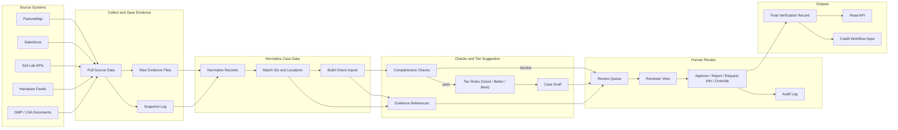

# Credit Verification Dataflow

This is the same flow described in `README.md`, shown in a simple step-by-step diagram.
Path: collect evidence -> normalize records -> run checks -> suggest tier -> human review -> final record.

## System Flow

## Decision Branches

1. If a blocking check fails, the case goes straight to human review.
2. If checks pass, the system suggests the best tier it can support.
3. Reviewer finalizes case:
   - `APPROVED`
   - `REJECTED`
   - `REQUESTED_INFO`
   - `APPROVED_WITH_OVERRIDE` (requires reason code and note)

## What Each Stage Produces

1. Collection stage:
   - immutable source snapshots
   - connector metadata
   - snapshot hashes
2. Normalization stage:
   - normalized case records
   - reconciliation metrics
   - check inputs
3. Checks and tier stage:
   - gate results
   - tier suggestion
   - evidence references
4. Review stage:
   - final status
   - reviewer action metadata
   - immutable audit events

## Versioning and Replay Anchors

Each final verification record stores:

- `policy_version` and policy hash
- all source `snapshot_id` values and payload hashes
- connector version metadata
- reconciliation rule version
- evidence reference manifest hash

With those anchors, the same ranch-period decision can be replayed and explained during audit.
